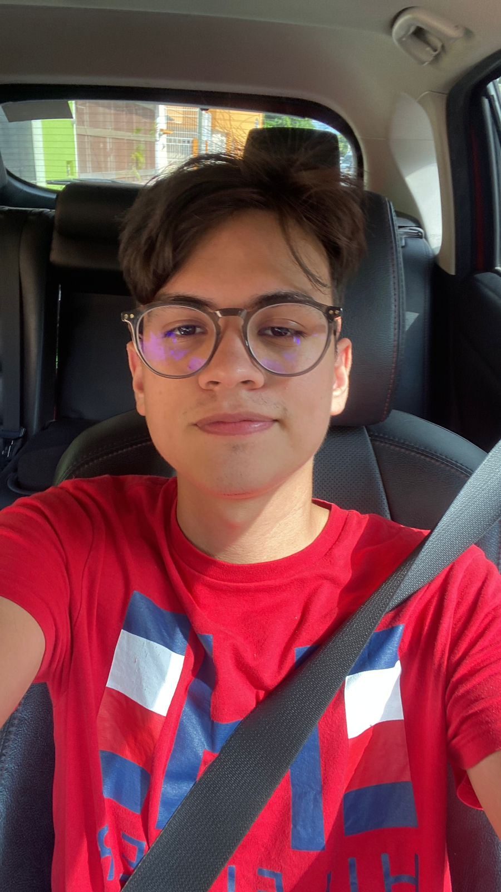

# ArquitecturaSoftware

Repositorio para la asignatura "Arquitectura de Software"

| Integrantes |                       |
|------------------------|------------------------|
| Daniel García Cetina   |  |
| Diego Alberto Alamilla Osorio |  |
| Miguel Ángel Castillo Sánchez |  |
